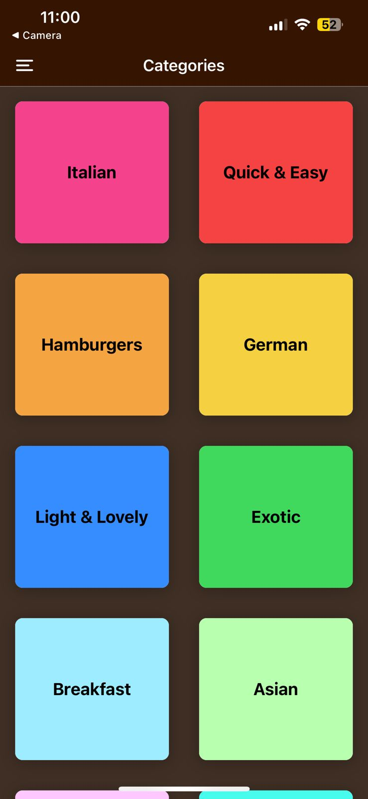
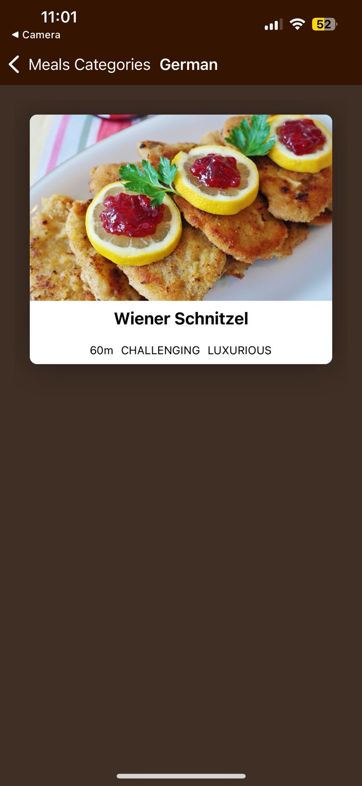
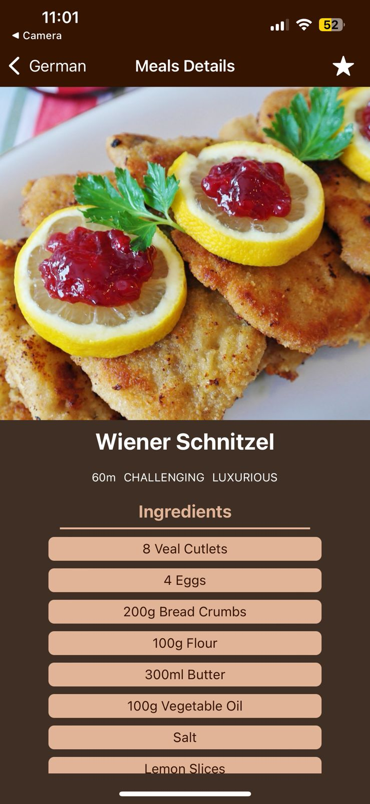
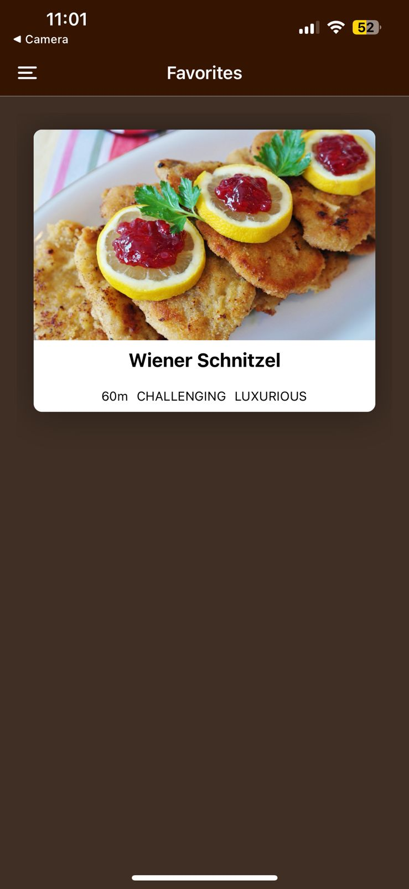

# Meals - React Native Application

## Overview

Meals is a mobile application developed using React Native. The application helps users explore a variety of meals categorized by type. Users can view meal details, browse through different meal categories, and manage their favorite meals.

## Features

- **View All Meal Categories**: Browse through a list of meal categories.
- **View Meals in a Category**: Explore meals within a selected category.
- **View Meal Details**: See detailed information about a specific meal, including ingredients and preparation steps.
- **Favorite Meals**: Manage and access a list of your favorite meals.

## Screens

1. **All Meal Categories Screen**: Browse through all available meal categories.
2. **Meals in Category Screen**: View meals listed under a specific category.
3. **Meal Details Screen**: Get detailed information about a selected meal.
4. **Favorite Meals Screen**: Access and manage your favorite meals.

## Installation

1. **Clone the Repository:**
   ```bash
   git clone https://github.com/Maghraby14/Meals-app.git

2. **Navigate to Project Directory :**
   ```bash
   cd Meals-app

3. **Install Dependencies:**
   ```bash
   npm install

4. **Start Application:**
   ```bash
   npm start
## Technologies Used

- **React Native**: JavaScript framework for building mobile applications.
- **Expo**: Toolchain for developing and deploying React Native applications.
- **React Navigation**: Library for routing and navigation within the application.
- **React Context**: State management library for managing application state.


## Screenshots

### All Meal Categories Screen


### Meals in Category Screen


### Meal Details Screen


### Favorite Meals Screen



## Contributors

- **Mohamed El-Maghraby** (Project Lead & Developer)
